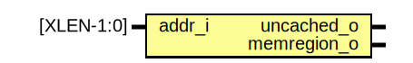

# Instruction Fetch Stage

The **Instruction Fetch (IF) stage** is a critical part of the TCore pipeline, responsible for initiating the execution cycle by fetching instructions from memory. This stage integrates several essential modules that ensure smooth and efficient operation. Here is an overview of its core functionalities:

## Core Functionalities

1. **Branch Prediction**: 
   - At the beginning of the fetch stage, branch prediction logic attempts to predict the outcome of branches (taken or not taken). This prediction minimizes stalls in the pipeline and ensures the processor continues executing instructions without waiting for the branch resolution.

2. **Program Counter (PC) Generation**:
   - The Program Counter (PC) is updated dynamically based on the branch prediction output and the previous instruction's execution. This mechanism ensures that the correct instruction address is computed efficiently.

3. **Instruction Fetching**:
   - Instructions are fetched from the instruction cache or main memory using the computed program counter. The fetched instructions are then passed on for further processing in subsequent stages.

4. **Compressed Instruction Decoding**:
   - If the fetched instruction is a compressed (16-bit) RISC-V instruction, it is expanded into its full 32-bit equivalent. This step ensures compatibility with the standard execution pipeline and resolves alignment issues introduced by compressed instructions.

5. **Return Address Stack (RAS)**:
   - The Return Address Stack (RAS) is a specialized structure used to store and retrieve return addresses for function calls. During the fetch stage, when a function call instruction is encountered, the return address is pushed onto the RAS. Conversely, when a return instruction is processed, the address is popped from the stack, ensuring accurate and efficient control flow handling. The RAS significantly improves performance by reducing branch mispredictions related to function calls and returns.

## Diagram

## Ports

| Port name     | Direction | Type           |
| ------------- | --------- | -------------- |
| clk_i         | input     |                |
| rst_ni        | input     |                |
| stall_i       | input     |                |
| fe_stall_i    | input     |                |
| lx_ires_i     | input     | ilowX_res_t    |
| pc_target_i   | input     | [XLEN-1:0]     |
| spec_hit_i    | input     |                |
| spec_o        | output    | predict_info_t |
| lx_ireq_o     | output    | ilowX_req_t    |
| pc_o          | output    | [XLEN-1:0]     |
| pc4_o         | output    | [XLEN-1:0]     |
| pc2_o         | output    | [XLEN-1:0]     |
| inst_o        | output    | [XLEN-1:0]     |
| imiss_stall_o | output    |                |
| is_comp_o     | output    |                |

### `stall_i` Signal Description

The `stall_i` signal serves as a critical control mechanism to temporarily halt the pipeline under specific circumstances. This signal is asserted in the following scenarios:

1. **Cache Misses**:  
   When an instruction or data request results in a cache miss, the pipeline must pause until the required data is fetched from the memory hierarchy.

2. **Multi-Cycle ALU Operations**:  
   During arithmetic or logic operations that require multiple clock cycles to complete, such as complex multiplications or divisions, the pipeline is stalled to prevent data hazards and ensure proper synchronization.

By introducing controlled halts, the `stall_i` signal ensures that dependencies are resolved and the pipeline operates reliably without proceeding to the next stage prematurely.

### `fe_stall_i`
The `fe_stall_i` signal is used to indicate a pipeline stall caused by load dependencies. This occurs in classic scenarios where an instruction depends on the result of a prior load operation. To prevent data hazards, the pipeline is temporarily stalled until the required data is available for subsequent instructions.

This signal plays a crucial role in maintaining data consistency and ensuring that dependent instructions are executed correctly without introducing errors into the pipeline.

### `lx_ires_i`
The `lx_ires_i` signal represents the response port for lower hierarchy memory when handling instruction cache misses. When an instruction request results in a cache miss, this signal facilitates the retrieval of the required instruction data from the lower memory hierarchy.

### `pc_target_i`
The `pc_target_i` signal carries the next Program Counter (PC) value determined during the execution stage. This value is typically computed based on branch decisions and directs the pipeline to the appropriate instruction address.

### `spec_hit_i`
The `spec_hit_i` signal indicates whether the branch prediction made earlier was correct. A high signal value confirms that the prediction was accurate, helping maintain pipeline efficiency by avoiding unnecessary stalls or flushes.

### `spec_o`
The `spec_o` signal provides branch prediction information to the pipeline. It communicates whether a branch was taken and, if so, the target Program Counter (PC) value. This ensures smooth instruction flow during branching scenarios.

### `pc_o`, `pc2_o`, `pc4_o`
These signals provide sequential Program Counter (PC) values to the pipeline:
- `pc_o`: The current Program Counter value.
- `pc2_o`: The current Program Counter plus 2, typically for compressed instruction alignment.
- `pc4_o`: The current Program Counter plus 4, for the next sequential 32-bit instruction.

### `inst_o`
The `inst_o` signal carries the fetched instruction to the Decode stage. This ensures that the pipeline receives the necessary instruction data for further processing.

### `is_comp_o`
The `is_comp_o` signal indicates whether the fetched instruction is a compressed (16-bit) instruction. This information is essential for ensuring proper handling and alignment within the pipeline.

## Instantiations

- ipma: pma
- gray_align_buffer: gray_align_buffer
- icache: icache
- compressed_decoder: riscv_compressed_decoder
- branch_prediction

# PMA Module: Physical Memory Attributes

## Diagram

The **PMA (Physical Memory Attributes)** module is a key component in the TCore RISC-V Processor, designed to manage memory access and define specific behaviors for different memory regions. Below is an overview of its functionality and implementation details.

## Key Features

1. **Memory Region Classification**:
   - The PMA module classifies memory regions based on predefined attributes such as cached/uncached and memory region type.

2. **Configurable Regions**:
   - Supports multiple memory regions, with attributes defined in a structured format.

### Inputs and Outputs
- **Inputs**:
  - `addr_i`: The input address to be checked against the defined memory attributes.
- **Outputs**:
  - `uncached_o`: Indicates whether the address belongs to an uncached region.
  - `memregion_o`: Indicates whether the address is part of a recognized memory region.

### Internal Data Structure
- The module uses a structured type, `pma_t`, to represent each memory region. This includes:
  - `addr`: Base address of the memory region.
  - `mask`: Bitmask to define the size of the memory region.
  - `uncached`: Specifies if the region is uncached.
  - `memregion`: Specifies if the address belongs to a valid memory region.

### Memory Region Definitions
The following regions are defined in the PMA module:

| Region      | Address Range      | Cached | Memory Region |
|-------------|--------------------|--------|---------------|
| **Memregion** | `0x4000_0000` - `0x400F_FFFF` | Yes    | Yes           |
| **UART**      | `0x2000_0000` - `0x2000_000F` | Yes    | No            |
| **Timer**     | `0x3000_0000` - `0x3000_0007` | No     | Yes           |

### Logical Flow
1. **Region Matching**:
   - Each incoming address is compared with predefined regions using the `addr` and `mask` fields.
   - Matching is performed with bitwise AND operations to efficiently check membership.

2. **Output Determination**:
   - Based on the matching region, the outputs `uncached_o` and `memregion_o` are set accordingly.

## Use Cases
- **Memory Management**: Defines behaviors for different memory regions in the TCore pipeline.
- **Peripheral Access**: Ensures correct handling of UART and timer regions.

# Gray Align Buffer: Instruction Alignment for Compressed Instructions

## Diagram

The **Gray Align Buffer** is a specialized module in the TCore RISC-V processor designed to handle instruction alignment, particularly for compressed instruction support. By leveraging a structure inspired by the Gray cache architecture, this module ensures seamless execution of compressed and uncompressed instructions.

## Key Features

1. **Support for Compressed Instructions**:
   - Handles RISC-V compressed (16-bit) and uncompressed (32-bit) instructions effectively.
   - Ensures proper alignment for seamless decoding and execution in the pipeline.

2. **Even and Odd Buffering**:
   - Separates instruction handling into even and odd parcels for optimized storage and retrieval.
   - Manages unaligned instructions efficiently, ensuring compatibility across different instruction formats.

3. **Conflict Resolution**:
   - Resolves cache misses and overlaps dynamically using stateful logic for hit/miss detection.

### Internal Structure
- **Buffer Organization**:
  - The buffer is divided into even and odd storage regions, optimized for efficient access.
  - Each buffer entry includes:
    - Validity bit
    - Address tags
    - Data parcels for instruction storage

- **Tag Matching and Addressing**:
  - Uses tags and masks to identify and locate instructions within the buffer.
  - Efficiently manages unaligned addresses using modular calculations.

## Use Cases
- **Compressed Instruction Handling**:
  - Essential for RISC-V cores supporting compressed instructions.
- **Cache Optimization**:
  - Provides seamless alignment and retrieval, reducing pipeline stalls.

# ICache: Fully Configurable Instruction Cache

## Diagram

The **ICache (Instruction Cache)** module is a critical component of the TCore RISC-V processor, designed to optimize instruction fetching by reducing memory access latency and improving overall pipeline efficiency. Its configurable nature makes it adaptable for various system requirements.

## Key Features

1. **Fully Configurable Design**:
   - Parameters such as cache size, block size, associativity, and word length are fully customizable, allowing the cache to be tailored to specific application needs.

2. **Multi-Way Associativity**:
   - Supports multiple associativity levels, enabling flexible memory access patterns and enhanced performance.

3. **Cache Management**:
   - Includes logic for handling cache hits, misses, and replacement policies.
   - Utilizes a pseudo-LRU (Least Recently Used) algorithm for efficient block replacement.

### Logical Flow
1. **Instruction Fetch Request**:
   - Receives fetch requests from the pipeline.
   - Determines whether the requested instruction block is present in the cache.

2. **Hit/Miss Detection**:
   - On a hit, retrieves the instruction block directly from the cache.
   - On a miss, forwards the request to lower memory and updates the cache upon data retrieval.

3. **Cache Update**:
   - Updates tag and data arrays with the fetched block from lower memory.
   - Maintains LRU state for future replacement decisions.

# Compressed Decoder: Instruction Expansion for RISC-V

## Diagram

The **Compressed Decoder** module is responsible for expanding RISC-V compressed (16-bit) instructions into their full 32-bit equivalents. This process ensures compatibility with the standard execution pipeline and seamless handling of mixed instruction formats.

## Key Role
- **Instruction Expansion**:
  - Decodes and converts compressed instructions into 32-bit instructions.

# Branch Prediction: Enhancing Pipeline Efficiency

## Diagram

The **Branch Prediction** modules in the TCore RISC-V processor are designed to improve pipeline efficiency by minimizing branch-related stalls and ensuring smoother execution. Various branch prediction techniques are parametrically supported, each optimized for specific scenarios.

## Supported Branch Predictors

### 1. **2-bit Dynamic Predictor**
- **Overview**: Utilizes a finite state machine (FSM) with four states (weak/strong taken, weak/strong not-taken) to dynamically predict branch outcomes based on past behavior.
- **Advantages**:
  - Adapts to branch patterns over time.
  - Balances accuracy and resource efficiency.
- **Use Case**: General-purpose pipelines with mixed branch behavior.

### 2. **Signed Branch Prediction**
- **Overview**: Incorporates signed-unsigned differentiation in branch prediction. Separate FSMs track prediction states for signed and unsigned branches.
- **Advantages**:
  - Enhances prediction accuracy for signed and unsigned conditional branches.
  - Reduces mispredictions in workloads with mixed signed/unsigned branching.
- **Use Case**: Workloads with diverse branching conditions.

### 3. **Forward Always-Taken, Backward Not-Taken Predictor**
- **Overview**: Predicts forward branches as always taken and backward branches as not taken. This static approach leverages the typical behavior of loops and forward jumps.
- **Advantages**:
  - Minimal hardware overhead.
  - Effective for loop-heavy workloads.
- **Use Case**: Embedded systems or applications with predictable branch patterns.

### 4. **Global History-Based Predictor (GShare)**
- **Overview**: Combines a Global History Register (GHR) with a Pattern History Table (PHT) to correlate global branch history with outcomes.
- **Advantages**:
  - High accuracy for complex branch patterns.
  - Utilizes global context for prediction.
- **Use Case**: High-performance pipelines with intricate branching behavior.
